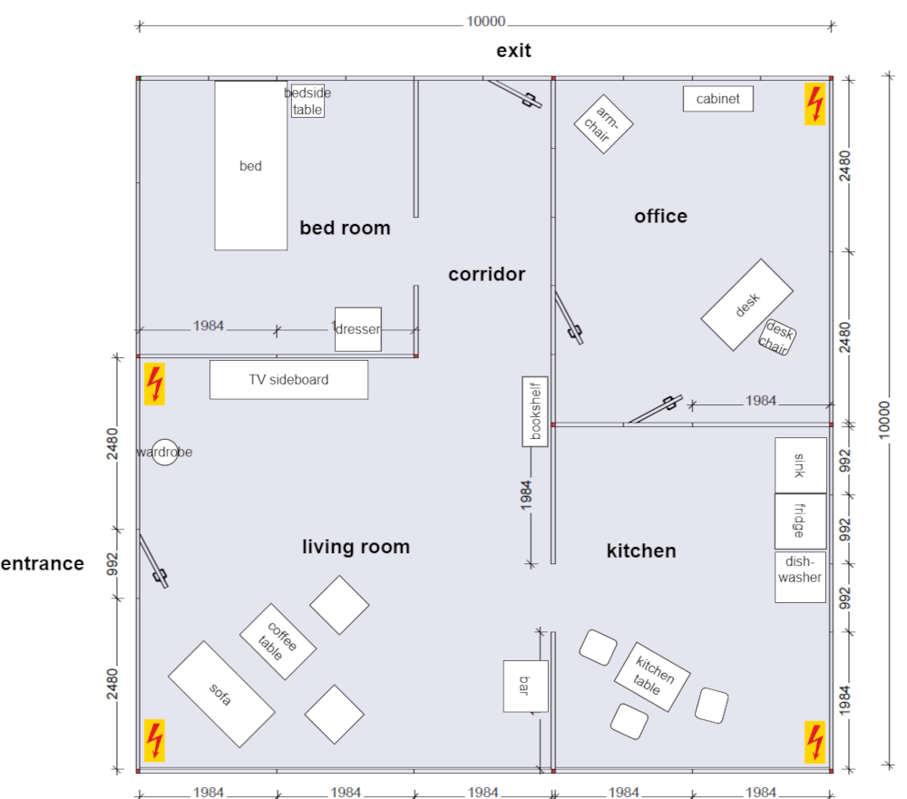
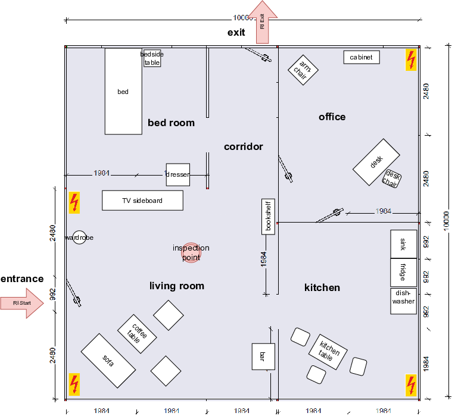
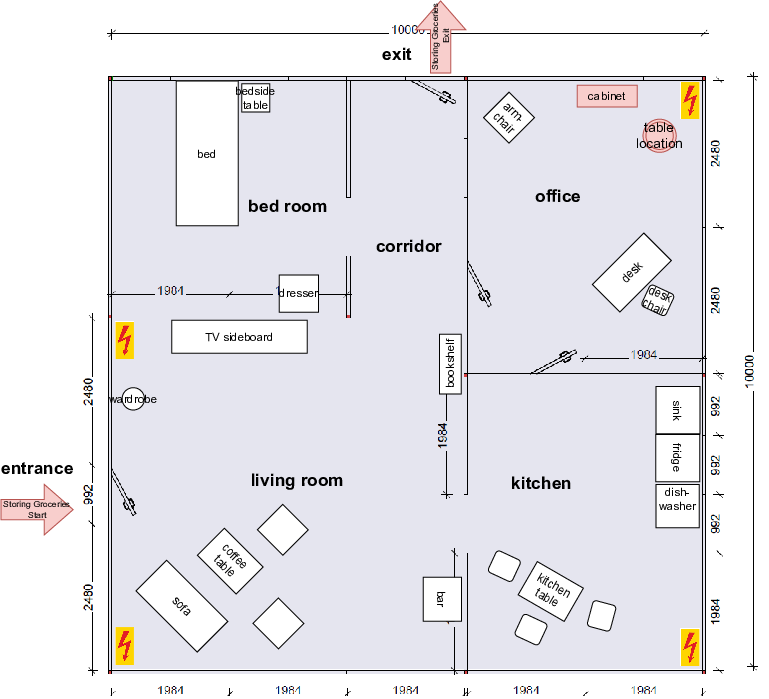
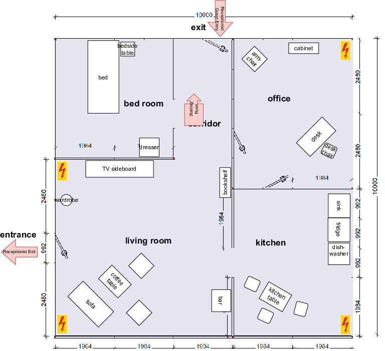
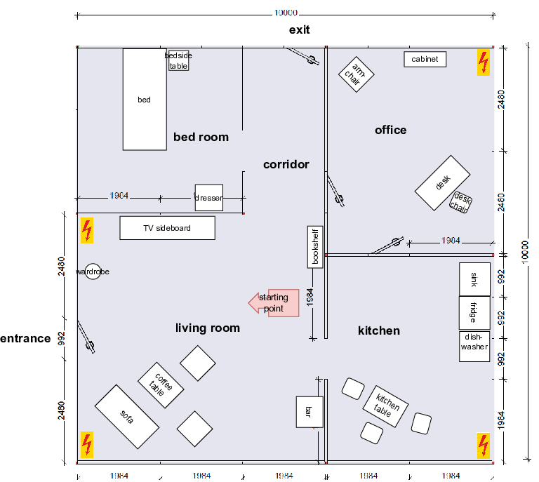
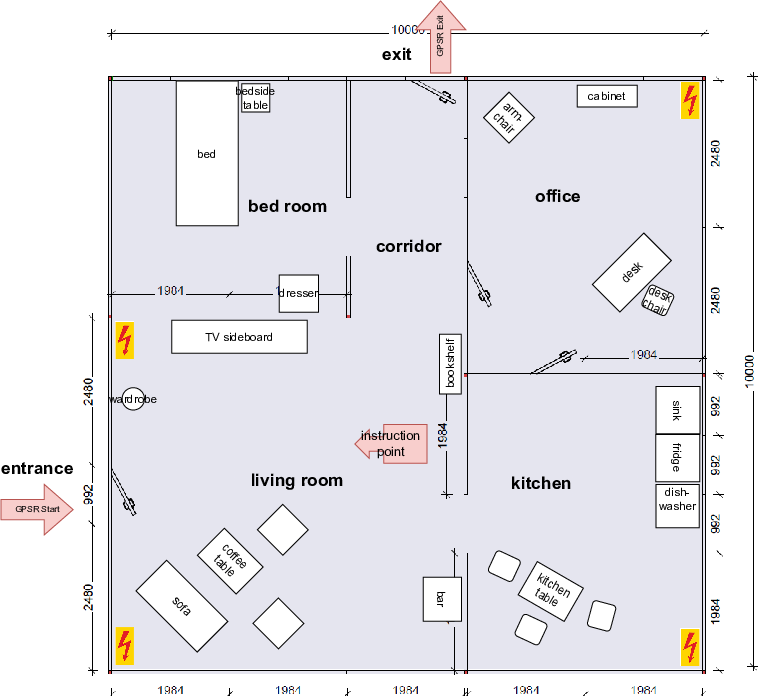
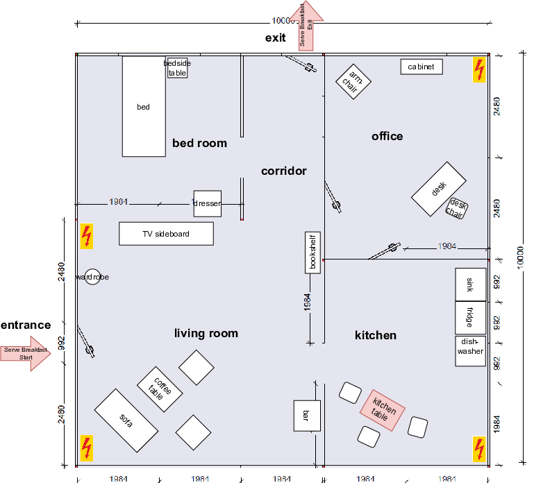
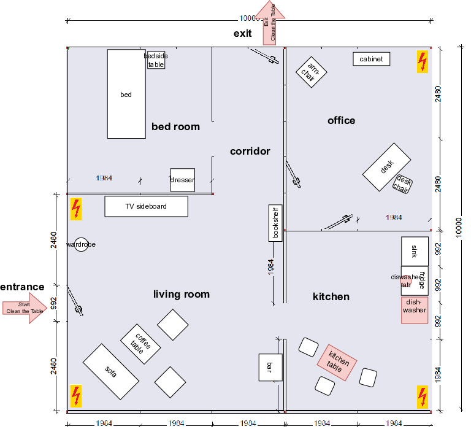
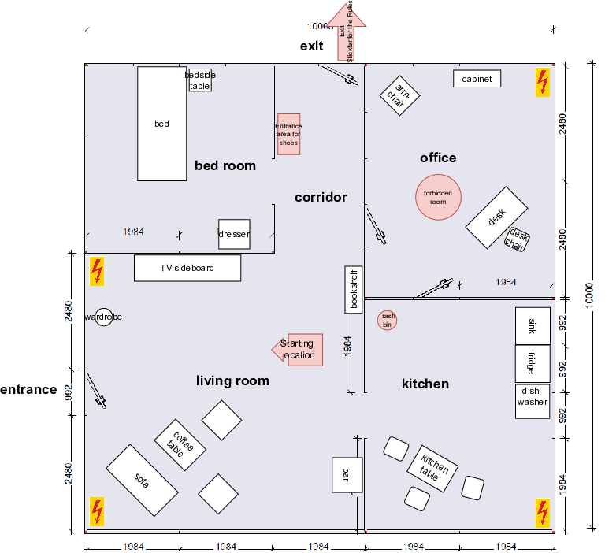
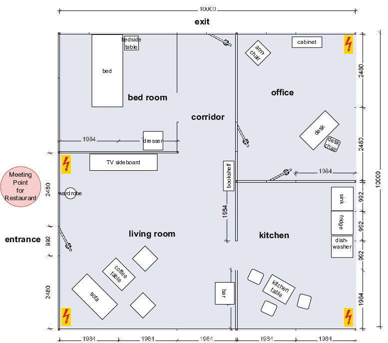

# Kassel 2024 

## Table of Contents

- [Scores](#scores)
- [Schedule](#schedule)
    + [Arena Mapping Slots](#arena-mapping-slots)
- [Arenas](#arenas)
    + [Teams](#teams)
    + [Arena Map](#arena-map)
    + [objects](#objects)
- [Robot Inspection and Poster Session](#robot-inspection-and-poster-session)
- [Stage 1](#stage-1)
    + [Receptionist](#receptionist)
    + [Storing Groceries](#storing-groceries)
    + [Carry my Luggage](#carry-my-luggage)
    + [Serve Breakfast](#serve-breakfast)
    + [GPSR](#gpsr)
- [Stage 2](#stage-2)
    + [Clean the Table](#clean-the-table)
    + [Stickler for the Rules](#stickler-for-the-rules)
    + [Restaurant](#restaurant)

## Scores

Team rankings and total scores from stage 1 and stage 2

|    | Team Name (ranking)                   | Total scores (stage 1 and 2) |
| -- | ------------------------------------- | ---------------------------- |
|    |                                       |                              |

## Schedule

|       | Wed April 17              | Thu April 18        | Fri April 19        | Sat April 20           | 
|-------|---------------------------|---------------------|---------------------|------------------------|
| 08:00 |                           |                     |                     |                        |
| 08:30 |                           |                     |                     |                        |
| 09:00 |                           |                     | Opening Ceremony    |                        |
| 09:30 |                           |                     |                     | Stickler for the Rules |
| 10:00 |                           |                     | Serve Breakfast     | Stickler for the Rules |
| 10:30 |                           | Storing Groceries   | Serve Breakfast     | Stickler for the Rules |
| 11:00 |                           | Storing Groceries   | Serve Breakfast     |                        |
| 11:30 |                           | Storing Groceries   |                     |                        |
| 12:00 |                           |                     |                     | FINALS                 |
| 12:30 |                           |                     | EGPSR               |                        |
| 13:00 | Mapping                   | Receptionist        | EGPSR               |                        |
| 13:30 | Mapping                   | Receptionist        | EGPSR               |                        |
| 14:00 |                           | Receptionist        |                     |                        |
| 14:30 |                           |                     | Clean the Table     |                        |
| 15:00 |                           | Carry my Luggage    | Clean the Table     |                        |
| 15:30 |                           | Carry my Luggage    | Clean the Table     |                        |
| 16:00 | Team Leader Meeting       | Carry my Luggage    |                     |                        |
| 16:30 |                           |                     |                     |                        |
| 17:00 |                           | GPSR                | Restaurant          |                        |
| 17:30 |                           | GPSR                | Restaurant          |                        |
| 18:00 | Robot Inspection          | GPSR                | Restaurant          |                        |
| 18:30 | Welcome Reception (18:45) |                     |                     |                        |
| 19:00 |                           |                     |                     |                        |
| 19:30 | Poster Session            | Team Leader Meeting | Team Leader Meeting |                        |
| 20:00 | Poster Reception          |                     |                     |                        |
| 21:00 |                           |                     |                     |                        |
| 22:00 |                           |                     |                     |                        |

## Arena

### Arena Mappig Slots

On 17.04.2024

| Time  | Team Name |
| ----- | --------- |
| 13:00 | b-it bots |
| 13:15 | Nimbro    |
| 13:30 | SCC       |
| 13:45 | Tobi      |

### Arena Map

### Objects

checkout the [object list](objects/objects.md)

### Locations

checkout [location list](maps/location_names.md)

## Robot Inspection and Poster Session

On 17.04.2024 18:00 (Robot Inspection)

| Ordering  | Team Name | Poster |
| ----- | --------- | --------- |
| 1 | b-it bots | 32 |
| 2 | Nimbro    | 38 |
| 3 | SCC       | 40 |
| 4 | Tobi      | 40 |

Announce location for Poster.

## Stage 1

### Storing Groceries

On 18.04.2024 10:30

| Ordering  | Team Name | Score |
| ----- | --------- | ------ |
| 1 | Nimbro | 330 |
| 2 | SCC    | 15 |
| 3 | Tobi       | 80 |
| 4 | b-it bots      | 0 |

Announce which table will be used

Announce what will be used as cabinet

### Receptionist

On 18.04.2024 13:00

| Ordering  | Team Name |
| ----- | --------- |
| 1 | b-it bots |
| 2 | Nimbro    |
| 3 | SCC       |
| 4 | Tobi      |

favorite drink is coke
host name is luca

### Carry my Luggage

On 18.04.2024 15:00

| Ordering  | Team Name |
| ----- | --------- |
| 1 | Tobi |
| 2 | SCC    |
| 3 | b-it bots       |
| 4 | Nimbro      |

### GPSR

On 18.04.2024 17:00

| Ordering  | Team Name |
| ----- | --------- |
| 1 | SCC |
| 2 | b-it bots    |
| 3 | Nimbro       |
| 4 | Tobi      |

### Serve Breakfast

On 18.04.2024 10:30

| Ordering  | Team Name |
| ----- | --------- |
| 1 | Nimbro |
| 2 | Tobi    |
| 3 | b-it bots       |
| 4 | SCC      |

## Stage 2

### Clean the Table

### Stickler for the Rules

### Restaurant

